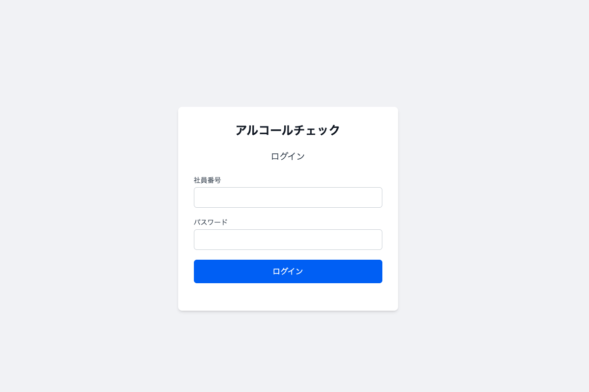
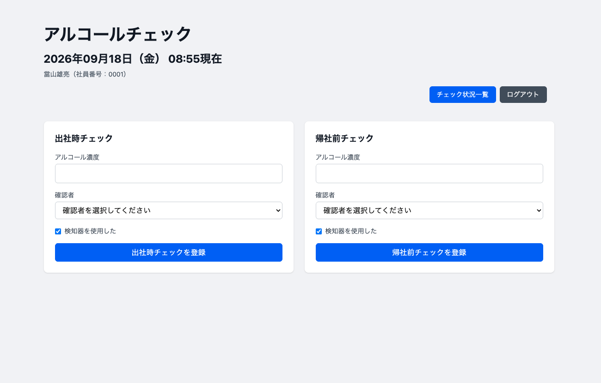
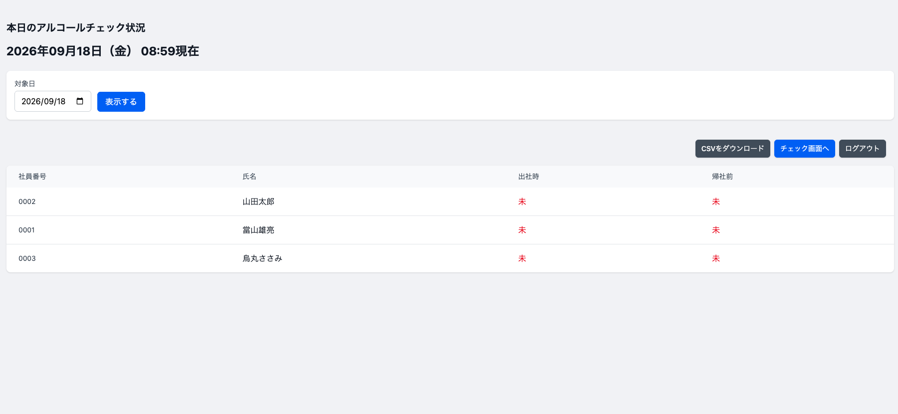
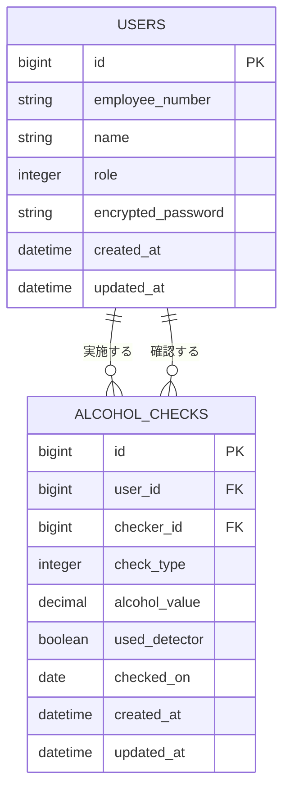

# Alcohol Check App

社内のアルコールチェック業務をWeb上で記録・管理するためのアプリケーションです。

従業員は出社時・帰社前のアルコールチェック結果を登録でき、管理者は従業員ごとの実施状況を日付別に確認できます。

## 開発背景

業務上、出発時・到着時にアルコールチェックを実施し、その結果を記録する必要があります。

これまでは紙を回覧して記録する形式で管理していましたが、日々の業務の中でチェックを忘れてしまうケースが発生しており、確実に実施・記録するための仕組みが必要だと感じていました。

そこで、アルコールチェックをWebアプリ化し、社員が日常的に利用しているスケジュール管理ツールに、あらかじめ本アプリへのリンクを毎日の予定として登録しておく運用を考えました。

普段の業務フローの中にアルコールチェックへの導線を組み込むことで、実施忘れを減らすとともに、紙による記録・回覧の手間を軽減することを目的として、本アプリを開発しました。

## 主な機能

### 一般社員

- 社員番号・パスワードによるログイン
- 出社時・帰社前のアルコールチェック登録
- アルコール測定値の記録
- 確認者の選択
- アルコール検知器使用有無の記録
- 当日のチェック実施状況の確認
- 同一社員による同日・同種チェックの二重登録防止

### 管理者

- 全社員のチェック状況確認
- 日付を指定したチェック状況確認
- 指定日のチェック記録のCSV出力
- ユーザー（社員）の一覧表示・新規登録・編集
- ユーザーごとの権限（一般社員 / 管理者）の設定

## 画面イメージ

### ログイン画面



### アルコールチェック登録画面



### 管理者画面



## 使用技術

### Backend

- Ruby 3.3
- Ruby on Rails 8.1
- PostgreSQL

### Frontend

- ERB
- Tailwind CSS
- Hotwire（Turbo / Stimulus）

### Authentication

- Devise

### Development Environment

- Docker
- Dev Containers

### Infrastructure

- Kamal（Dockerコンテナによるデプロイ）
- Kamal Proxy（HTTPS化）
- VPS

## ER図



### データ整合性

`alcohol_checks`テーブルでは、以下の3カラムに複合ユニークインデックスを設定しています。

- `user_id`
- `check_type`
- `checked_on`

これにより、同一社員が同じ日に同じ種類のアルコールチェックを複数登録することをDBレベルでも防止しています。

## データ設計

### User

社員情報を管理します。

主な項目：

- 社員番号
- 氏名
- パスワード
- 権限（一般社員 / 管理者）

### AlcoholCheck

アルコールチェックの記録を管理します。

主な項目：

- チェックを実施した社員
- チェック種別（出社時 / 帰社前）
- アルコール測定値
- 確認者
- アルコール検知器の使用有無
- 記録日時

UserとAlcoholCheckを関連付け、チェックを実施した社員とは別に、確認者についてもUserとの関連を持たせています。

## 工夫した点

### 1. 実際の業務フローを意識した設計

単にアルコール測定値を保存するだけではなく、「誰が測定したか」「誰が確認したか」「出社時・帰社前のどちらか」といった、実際の運用で必要になる情報を記録できるようにしました。

また、社員が日常的に使用するスケジュール管理ツールから本アプリへアクセスする運用を想定し、新しい業務を増やすのではなく、既存の業務フローの中にアルコールチェックを組み込むことを意識しました。

### 2. 同日・同種チェックの二重登録防止

同じ社員が同じ日に同じ種類のチェックを複数回登録しないよう、モデルのバリデーションとDBの複合ユニークインデックスの両方で制御しています。

モデルのバリデーションでは画面上に分かりやすいエラーメッセージを表示し、DB制約では同時リクエストなどでバリデーションをすり抜けた場合でも重複データが保存されないようにしています。

一方で、同じ日であっても出社時と帰社前はそれぞれ登録できるようにしています。

チェック日は登録時に`checked_on`カラムへRailsのタイムゾーンを考慮した日付として保存し、1日単位での判定や日付別の集計に利用しています。

### 3. 確認者と実施者を同じUserモデルで管理

確認者専用のテーブルを作成するのではなく、社員を管理するUserモデルを確認者としても利用しています。

AlcoholCheckから「チェックを実施した社員」と「チェックを確認した社員」の2つの関連を持たせることで、社員データを重複して管理しない設計にしました。

また、本人が自分自身を確認者として登録できないようバリデーションを実装しています。

### 4. 一般社員と管理者の権限制御

Userに一般社員・管理者の権限を持たせています。

一般社員は自身のアルコールチェックを登録し、管理者は全社員の実施状況を確認できます。

管理画面へのリンクを非表示にするだけではなく、Controller側でも権限を確認することで、一般社員がURLを直接入力した場合にも管理画面へアクセスできないようにしています。

管理者向けControllerは共通の`Admin::BaseController`を継承し、ログイン確認と管理者権限の確認を一箇所にまとめています。新しい管理機能を追加した際に権限チェックの付け忘れが起きにくい構成にしています。

### 5. 管理業務を考慮したCSV出力

管理者は対象日を選択してチェック状況を確認でき、その日のアルコールチェック記録をCSVとして出力できます。

CSVには社員番号、社員名、チェック種別、測定値、確認者、検知器使用状況、記録時刻など、管理に必要な情報を出力します。

### 6. N+1問題を意識したデータ取得

一覧表示やCSV出力では関連するUserや確認者の情報を複数回参照するため、Active Recordのincludesを利用して不要なSQLの発行を抑えることを意識しています。

### 7. 管理者によるユーザー管理

社員の登録・編集・権限変更を管理画面から行えるようにし、コンソール操作なしで運用できるようにしました。

新規登録時のパスワードは管理者が画面で入力するのではなく、環境変数で設定した初期パスワードを付与する方式にしています。また、アルコールチェック記録を持つユーザーは削除できないよう関連に制約を設け、過去の記録が失われないようにしています。

### 8. 本番環境へのデプロイ

Kamalを使ってDockerコンテナとしてVPSへデプロイし、Kamal ProxyによるHTTPS化を行っています。PostgreSQLも同一サーバー上のコンテナとして稼働させています。

パスワードなどの秘密情報はリポジトリに含めず、環境変数として注入しています。

## テスト

Rails標準のMinitestを使用し、業務上重要なルールとアクセス制御を中心にテストしています。

主なテスト内容：

- 正常なアルコールチェックを登録できること
- アルコール測定値がない場合は登録できないこと
- 本人を確認者として登録できないこと
- 同日・同種のチェックを二重登録できないこと
- 同日でも出社時・帰社前はそれぞれ登録できること
- DBレベルでも同日・同種の重複登録を防止できること
- 一般社員が管理画面へアクセスできないこと
- 管理者が管理画面へアクセスできること
- ログインユーザーがアルコールチェックを登録できること
- 未ログインユーザーがアルコールチェックを登録できないこと
- 管理者がユーザーを登録・編集できること
- 登録したユーザーに初期パスワードが設定されること
- 社員番号の重複や氏名の未入力ではユーザーを登録・更新できないこと
- 一般社員・未ログインユーザーがユーザー管理機能を利用できないこと

テストは以下のコマンドで実行できます。

```sh
bin/rails test
```

## 今後の改善点

- ユーザー自身によるパスワード変更機能
- 管理者画面の検索・絞り込み機能の拡充
- 一般社員が自身の過去の記録を確認できる履歴機能
- テストケースの追加
- UI / UXの改善

## ローカル環境での起動

リポジトリをcloneします。

```sh
git clone <repository-url>
cd alcohol-check-app
```

Dev Containerを起動後、初期ユーザーのパスワードを環境変数に設定します。

```sh
export INITIAL_ADMIN_PASSWORD=<初期管理者のパスワード>
export INITIAL_USER_PASSWORD=<管理画面から登録するユーザーの初期パスワード>
```

データベースを準備します。DBの新規作成時にはseedが実行され、社員番号`0001`の初期管理者が作成されます。

```sh
bin/rails db:prepare
```

開発サーバーを起動します。

```sh
bin/dev
```

ブラウザから以下へアクセスします。

http://localhost:3000

初期管理者（社員番号`0001`）でログインし、管理画面の「ユーザー管理」から社員を登録してください。

## デプロイ

Kamalを使用してデプロイします。秘密情報は`.kamal/secrets`（Git管理対象外）から読み込みます。

```sh
bin/kamal deploy
```
